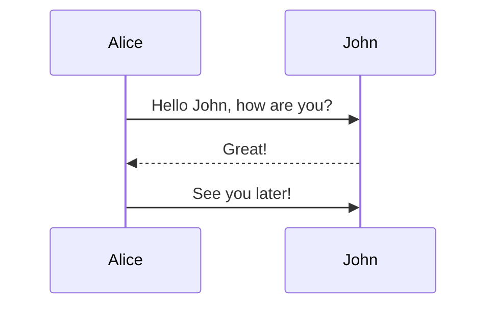

# Paradigmas de programación

**Enfoque del curso**

<div style="text-align: justify;">
Des de los orígenes de la ciencia de la computación, se han creado distintos paradigmas de programación que han proporcionado soluciones y puntos de vista diferentes a los problemas y retos que plantea la construción de programas informáticos. El presente curso pretende dar a conocer algunos de los paradigmas de mayor relevancia más allá de la orientación a objetos que se utilizará como punto de partida para su exploración. El objetivo del curso es enriquecer la visión y recursos del alumno para que adquiera el criterio que le permita utilizar el paradigma adecuado para cada problema. Se hará especial atención en el paradigma funcional con lenguage Scala, ya que al ser
multiparadigma se erige como ideal para que el alumno pueda realizar una transición suave de OOP a Programación Funcional.
</div>


## **Parte 1**: Introducción a otros paradigmas de programación


### 1. Programación funcional

    1.1. Introducción

        1.1.1. Qué es un paradigma de programación
        1.1.2. Origen de la programación funcional
        1.1.3. ¿Porqué?
        1.2.4. Desmontando OOP 

    1.2. Principios
        1,2.1- Función matemática y propiedades

### 2. Modelo de actores

    2.1. Sub item
    2.2. Sub item


### 2. Paradigma Reactivo

    2.1. Sub item
    2.2. Sub item


### Programación funcional

#### 1.1- Introducción

##### 1.1.1- Qué es un paradigma de programación
<div style="text-align: justify;">
Ante el reto que presenta construir programas informáticos han ido apaerciendo distintos paradigmas de programación. Cada uno pone el foco en diferentes dimensiones del problema proporcionando un punto de vista o enfoque particular. 

Ejemplos de dimensiones pueden ser:

- modelo de ejecución: Cómo ejecuto los Side Effects? 
- organización del código: OOP agrupa estado y comportamiento en una classe.
- modelo de concurrencia: Threads con código bloqueante, Green Threads, Actores... 
...

Cada paradigma tiene, de una manera más o menos formal, un conjunto de reglas o de principios que constituyen el fundamento teórico. Ej OOP: abstracción, encapsulamiento, herencia y polimorfismo


Los paradigmas de programación constituyen al desarrollador o arquitecto de software del conjunto de herramientas necesarias para abordar un problema de la mejor manera possible. 
</div>

_Ejemplos:
- **Imperativo**: 
    - Procedural: C
    - Object Oriented Programming
- **Logic programming**: Basados en logica formal como Prolog 
- **Reactive Programming**: El resultado deseado es descrito como la propagación de elementos a traves de un flujo de datos. 
- **Funcional programming**
        
      
##### 1.1.2. Origen de la programación funcional

Lisp, el primer lenguage de programación funcional fué desarrollado en 1960 en el MIT. En aquellos años fueron creados también los primeros lenguajes orientados a objetos. Sin embargo, Alan Kay, al que se le otorga el acuñamiento del término, lo definia de una forma que se asemeja más al modelo de actores a cómo se definie la OOP hoy en día.
Alan Kay definia la comunicación entre objetos como un intercambio de mensajes, no como una llamada a un método.
https://adabeat.com/fp/the-history-of-functional-programming/

 
 


```scala
trait LivingCreature

case class Person(name: String, age: Int)
val persion = Person
```




### 2. Paradigma Reactivo

#### 2.1- Introducción

La primera formalización del paradigma reactivo la encontramos en la publicación del Reactive Manifesto en 2013. En él se exponen los principios de diseño para un sistema reactivo o Reactive System que, a nivel de implementación, se concreta con el paradigma Reactive Programing. El target de los sistemas reactivos son sistemas distribuidos con alta concurrencia.


- Reactive Systems: Arquitectura y diseño
- Reactive Programming: Declarativo y vasado en eventos


El driver principal de los sistemas reactivos es la responsividad Responsiveness: Capacidad de respuesta. Para conseguir esta capacidad de respuesta, el sistema tiene que solucionar las siguientes cuestiones:

- Responsive en fallo (Resiliente): El sistema debe mantener la capacidad de respuesta incluso ante fallos.
- Responsive bajo carga (Elástico): El sistema debe mantener la capacidad de respuesta con altas cargas de trabajo.

El Reactive Manifesto prescribe que para conseguir estas propiedades, necesitamos que el sistema sea Message-driven.


#### 2.2- Reactive Programming

Es un subconjunto de Asynchronous Programming.

Asynchronous Programming: Modelo de concurrencia donde un conjunto de instrucciones, como una llamada a una función, se ejecutan de forma que no bloqueen el flujo de ejecución principal esperando su finalización. Por el contrario, la finalización de una ejecución asíncrona impactará en el flujo principal mediante la ejecución de una función de callback.

Asynchronous Programing simplemente hace énfasis en la ejecución asíncrona (no bloqueante) de computaciones dentro de un programa. 


***Asincronía vs concurrencia:***

La **concurrencia** és habilidad para ejecutar tareas "simultaneamente". Las tareas se trocean y se ejecutan los trozos de forma entrelazada.
Modelos de concurrencia: 

- Threads: Un thread por tarea. Trozeado de tareas en el tiempo: Cada thread ejecuta un subconjunto de instrucciones en su turno de CPU.

- Corutinas (Kotlin): El compilador trozea nuestra función en trozos etiquetados y los ejecuta de forma concurrente con otras corrutinas. Dentro de una misma corutina el control de ejecución de los trozes se realiza por continuations.

- Go routines, JVM Virtual threads,....

La **asincronía** es una forma de implementar un sistema concurrente. Hace referéncia a la habilidad de un sistema para ejecutar una tarea y continuar con la ejecución de otra sin que la primera haya acabado. La ejecución de tareas se ejecuta de forma no bloqueante.


Así pues Reactive Programing se basa en la programación asíncrona y orientada a mensajes: Modelo de Actores
- Elasticidad que proporciona la configuración en cluster de akka
- Resiliencia: 
    - A nivel de actor: Jerarquía de actores con supervisor. Cuando hay una excepción en un Actor y este peta, su actor supervisor en la jerarquía determina qué haver. Normalmente poner en marxa otra instancia. Lo importante es que el fallo no se propaga. Let it crash.
    - A nivel de nodo del cluster: Actor Rebalancing en sistemas de actores con Actor   Sharding (Kubernetes como pareja de baile)

Vemos que la resiliencia va más allá de la toleráncia a fallos. No se trata de que ante fallos el sistema continue funcionando de forma degradada sino que el sistema se recupere.


**Implementaciones:** Akka/Pekko en Scala y Akka.Net en c# son implementaciones de un ReactiveSystem basado en el Modelo de Actores.

**Akka streams**

Un buen ejemplo de Reactive Programing es Akka Streams. Basa


Evento vs mensaje