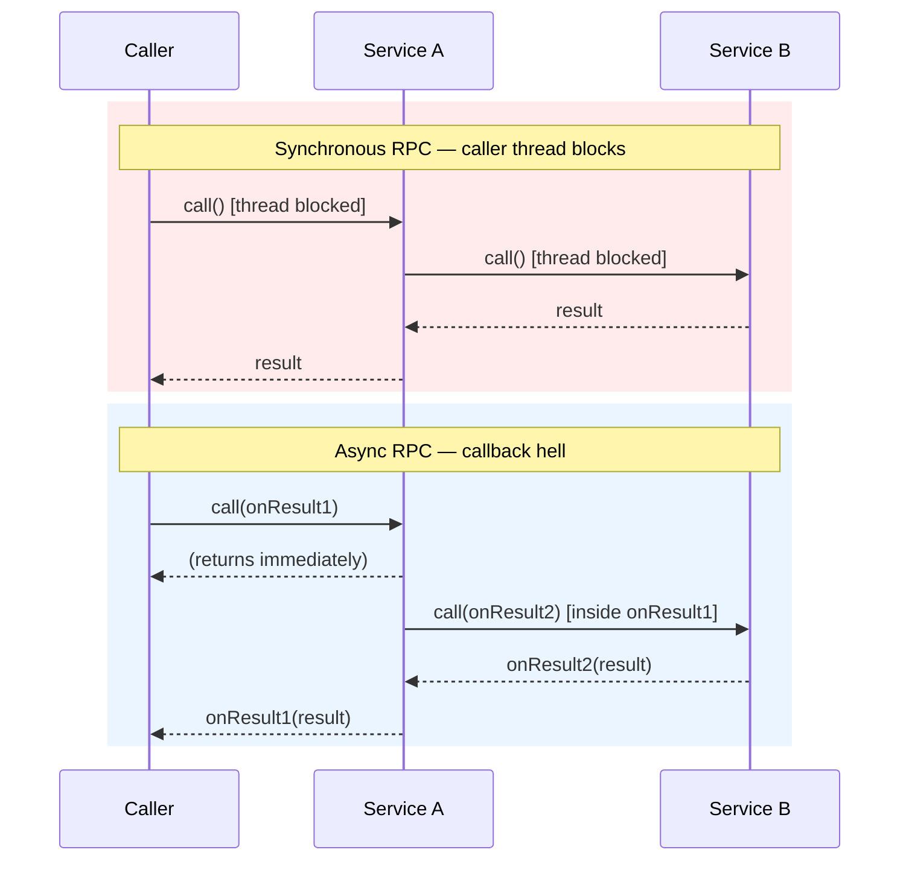
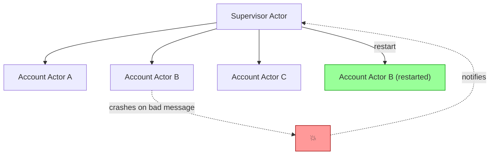
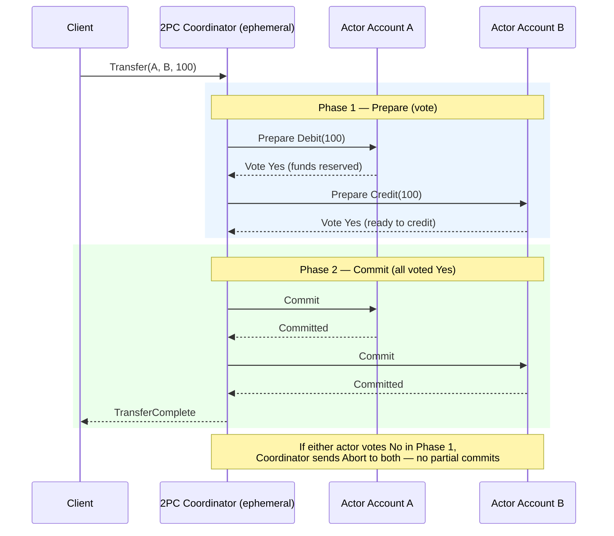
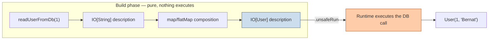
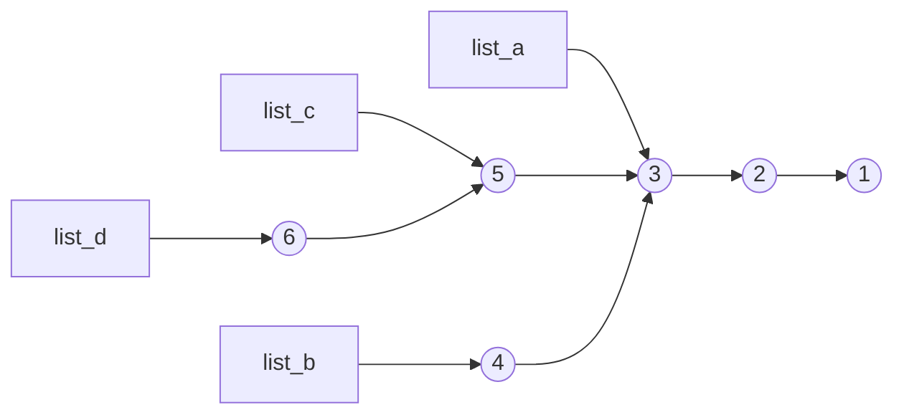

# Programming Paradigms

**Course Overview**

<div style="text-align: justify;">
Since the origins of computer science, different programming paradigms have been created that have provided different solutions and perspectives to the problems and challenges posed by the construction of computer programs. This course aims to introduce some of the most relevant paradigms beyond object orientation, which will be used as a starting point for their exploration. The goal of the course is to enrich the student's vision and resources so that they acquire the criteria to use the right paradigm for each problem. Special attention will be paid to the functional paradigm using the Scala language, since being multi-paradigm it stands as ideal for the student to make a smooth transition from OOP to Functional Programming. 
Functional programming if the main paradigm we study in this course because it has been influencing all mainstream programing languages for decades.
</div>

---

## Table of Contents

**Part 1 — Introduction to other Programming Paradigms**

- **1. What is a Programming Paradigm**
- **2. Actor Model**
    - 2.1. Leaving the conventional paradigm
    - 2.2. What is an actor
    - 2.3. Resilient systems
    - 2.4. Actors and event sourcing
    - 2.5. Examples
    - 2.6. Counter-examples and conclusions
- **3. Reactive Paradigm**
    - 3.1. Introduction
    - 3.2. Reactive Programming
    - 3.3. Akka Streams
- **4. Functional Programming**
    - 4.1 Origin of functional programming
    - 4.2. Principles
        - 4.2.1 Mathematical function and its properties
        - 4.2.2 Examples of side effects
        - 4.2.3 Expressions vs statements
        - 4.2.4 Composability
    - 4.3. Benefits of functional programming
        - 4.3.1 Testing (+ law-based testing)
        - 4.3.2 Local reasoning (7 items in mind)
        - 4.3.3 Composition, the essence of computation
    - 4.4. Side Effects
        - 4.4.1 Segregation of pure code. Hexagonal architecture
        - 4.4.2 Effects system (IO monad + Resource pattern)
    - 4.5. Immutability
        - 4.5.1 Benefits
        - 4.5.2 Path Copying and Structural Sharing
    - 4.6 Algebra (Monoid typeclass + sumM)
    - 4.7 Characteristics of a functional language

**Part 2 — Scala Language**

- 2. Handling side effects
    - 2.1 Option vs null
    - 2.2 Try vs Exceptions
    - 2.3 Either
- 3. Case Classes and Pattern Matching
- 4. Algebraic Data Types
    - 4.1 Product Types and Sum Types
    - 4.4 Union Types (Scala 3)
    - 4.5 Phantom Types
    - 4.6 Opaque Types
- 5. High Order Functions
- 7. Collections
- 8. For Comprehension
- 9. Inheritance vs Type Classes
- 10. Recursion
    - 10.1 Trampoline
- 11. Monad
    - 11.4 Exercise: Programming an IO Monad
    - 11.5 Future vs IO

**Appendix: Effect types cheat sheet**

---


### 1. What is a Programming Paradigm

> **In this chapter**
> - Why "paradigm" is more than a buzzword, and how to tell two paradigms apart pragmatically.
> - The symptoms that pushed the industry to look beyond conventional OOP + Threads + RPC.
> - A short diagnosis you'll carry through the rest of the course: shared mutable state, temporal coupling, and hidden side effects.

Picture a 3 a.m. page: an on-call engineer stares at a stack trace that only reproduces under load, never locally. Two requests raced on the same object, one update silently overwrote the other, and nobody can say *when* it happened — only that it did. This is not a bug story about one bad line of code. It is a story about the paradigm the code was written in.

<div style="text-align: justify;">
Faced with the challenge of building software programs, different programming paradigms have emerged. Each one focuses on different dimensions of the problem, providing a particular point of view or approach.
</div>

Examples of dimensions can be:

- execution model: How do I execute Side Effects?
- code organization: OOP groups state and behavior in a class.
- concurrency model: Threads with blocking code, Green Threads, Actors...


Each paradigm has, in a more or less formal way, a set of rules or principles that constitute its theoretical foundation. E.g. OOP: abstraction, encapsulation, inheritance and polymorphism.


Programming paradigms provide the developer or software architect with the set of tools necessary to approach a problem in the best possible way.
</div>

Examples of paradigms:
- **Imperative**: A program is a list of instructions.
    - Procedural: C.
          No Goto's but procedures (we leave the term functions for functional programming).
          The fundamental building block is the procedure.
    - Object Oriented Programming. We encapsulate state together with its related procedures. Like in a closure. So you can have several procedures with different state. This is called encapsulation in objects.
      "An object is just a poor man's closure", Norman Adams.
      The fundamental building block is the object/class.
- **Logic programming**: Based on formal logic such as Prolog.
- **Reactive Programming**: The desired result is described as the propagation of elements through a data flow.
- **Functional programming**: A program is a function.
  
**The Translation Test**
    Given two programs that solve the same problem (functionally equivalent), one can detect that a different programming paradigm has been followed in each them when they present significant conceptual differences beyond syntax. If we can simply translate one program into the other by translating syntax and little else, we are within the same paradigm. If, on the contrary, we have to rewrite it using new abstractions and concepts, we have changed paradigm.
        

Historically paradigm shifts have meant the transition from one world view to a new vision sometimes incompatible with the previous one,
sometimes complementary.

Copernican cosmology (the earth is not the center of the universe) was incompatible with what came before. However, the theory of relativity does not invalidate classical mechanics. It provides tools to understand phenomena at other scales (e.g.: speeds close to the speed of light). Or quantum mechanics at the subatomic scale. But if I need to calculate the speed at which an apple falls from a tree, classical mechanics works great.

We will see that knowing programming paradigms broadens our toolbox to select the most appropriate one depending on the problem at hand.


Why are we leaving OOP?

Object-oriented programming solved a fundamental problem: how to organise large programs by encapsulating state and behaviour. However, as systems became concurrent and distributed, some of the assumptions behind traditional OOP became problematic.


Problems:

- **shared mutable state**: Mutating state concurrently has some problems like 
	- race conditions: where final result depends on timming
	- lost updates: specific form of race condition where one modification completely overwrites another.
	- data corruption: concurrent mutations can temporarily or permanently violate state invariants

	To avoid this we need to access state in a coordinated way, so we add mechanisms:
	- locks
	- synchronized blocks
	- mutexes
	- semaphores
	- atomics references
	- concurrent collections
	
	While this works it ads a lot of complexity and cognitive load for the developer because business logic mixes with concurrency management.
		
- **temporal coupling**: Correctness depends not only on _what_ happens, but _when_ it happens.

- **hidden side effects**:  Effects of calling a method are not obvious from its interface or from the local code, making it difficult to reason about.

For instances:

	```java 
	userService.updateUser(user);
	```

What happens inside the call? Is database updated? kafka message published? email sent?

If the result of a function call depends on a hidden shared state, identical calls may produce different answers.

Why this is a problem? 

If we have:

```java
a();
b();
c();
```

If you want to swap calls a and b you have to know:

	- Do they modify shared state?
	- Do they touch the database?
	- Do they mutate their arguments?
	- Do they publish events?
	- Do they depend on the current time?

> **Summary**
> - A paradigm is a lens: it decides which dimension of a problem (execution, organization, concurrency) you optimize for first.
> - Two programs are in different paradigms if translating one into the other requires new abstractions, not just new syntax.
> - Conventional OOP concurrency (Threads + RPC) accumulates three symptoms as systems scale: shared mutable state, temporal coupling, and hidden side effects.
> - These symptoms are exactly what our 3 a.m. page was about — and they are the motivating problem for the rest of this course.

Diagnosis done. The prescription starts with a 50-year-old idea that never quite made it into mainstream OOP: what if objects never shared memory, and only ever talked by sending each other messages?

### 2. Actor Model

> **In this chapter**
> - Where the Actor Model came from, and why Alan Kay's original vision of OOP looked more like it than what we build today.
> - How a single abstraction (the actor) replaces the dual Threads/RPC toolbox for concurrency *and* scalability.
> - A running case study — a banking Ledger — that we'll design first with Threads, then redesign with actors, and keep revisiting in later chapters.

#### 2.1- Leaving the Conventional Paradigm

Between 1960 and 1970 the first object-oriented languages were created. However, Alan Kay, who is credited with coining the term, defined it in a way that resembles the actor model more closely than how OOP is defined today.
Alan Kay defined the communication between objects as a message exchange, not as a method call.
https://adabeat.com/fp/the-history-of-functional-programming/

So if we pull the thread of this change on how objects communicate we will find ourselves in a different paradigm where objects (actors) are still the building blocks but the concurrency model and scalability are completely different. This small change in how objects communicate is the start of our journey. 

The most widespread programming paradigm is OOP with a concurrency model based on Threads (or light threads/fibers) and using RPC (Remote Procedure Calls). REST API, grpc, database accessing, etc... all this are RPCs. 

The problem with this combination comes with scalability. We define scalability as the ability of an application or system to handle an increase in demand while maintaining response time.
A system can scale at two levels:
- *scale up* (vertical): using more CPUs within the same machine
- *scale out* (horizontal): adding machines or nodes to the distributed system

Concurrency is a means to achieve scalability. If we have to execute two uncorrelated computations, we execute them "at the same time" (in parallel or in an interleaved fashion).

The conventional paradigm uses Threads for scale up and RPC for scale out.
RPC assumes that a call over the network is no different from a call on the same machine. If done synchronously it will block the calling thread, making inefficient use of resources. If we make an asynchronous call, we will have to specify a callback function which adds complexity to the application. You can end up with callback hell if in the callback you make another call that needs its own callback, etc...



Another problem with this paradigm is that we get code that continually mixes the two abstractions aimed at each type of scalability. You end up hardcoding which parts of your application will use Threads for scale up and which will use RPC for scale out.

#### 2.2- What is an Actor

Carl Hewitt defined the actor model in 1973.

The actor model provides a single abstraction for concurrency and scalability.


***Actor***: The actor is the basic unit of computation in the actor model.

What can an actor do:

  - It can receive messages that it processes sequentially in order of arrival. It stores them in a queue before processing them.
  - It contains state that can be modified based on the received messages.
  - It can send messages to other actors.
  - It can create other actors, generating a hierarchical supervision tree and managing their life cycle. If an actor crashes, its supervisor is notified and can decide what actions to apply.

The first mental model that we can build of an actor is a OOP class that communicates with other actors by sending messages instead of calling other actors methods. In order to keep up with its received messages, the actor has a built-in queue.

In terms of memory footprint, an actor is very light abstraction. It only occupies the memory needed for the state, for the queue and very little extra which typically results in a few KB.
  
The concurrency model plays a crucial role in the actor model. It consists of a single thread (or thread pool, one per core) that executes each actor.
Executing an actor means checking if it has messages in the queue and calling the associated processing logic. Thus, a single thread is shared by several actors, so an actor must not contain blocking code as it would block the execution of other actors.

Note that the state contained in an actor will not be concurrently mutated. When an actor is processing a message it can mutate its state with the guarantee that no other mutation will happen concurrently.

If concurrently mutating the state was the problem, well, we keep mutating the state but not concurrently. The Actor is the unit of state, the unit of concurrency and the unit of functionality, so it is the main building block.

***Identity***

An actor identity is defined by an id that is provided on it's creation. Example: In the case of a bank each account will be modeled with an actor holding the account state.

***Clustering***

A complete Actor framework has a cluster functionality where multiple nodes of actors can work together while living in different nodes of the same cluster.
The actor framework owns the responsibility of forming the cluster and managing it by electing a cluster coordinator role, restarting unresponsive nodes, solve split brain problems, etc... and also distributing actors across the cluster.

***Location transparency***: An actor has an address similar to a file path + its identity that locates it in the hierarchical tree and allows it to be found to send messages. In the case of a distributed system made up of several nodes running an actor system, the location of a specific actor in the cluster is transparent. That is, when sending a message to an actor, the same API is used whether the actor is on the same machine or is remote.

***Actor Sharding***

As our actor system grows and we need to handle more and more actor instances of the same type and they are receiving more and more messages, scaling vertically is no longer the solution so we have to scale horizontally forming a cluster and we need to distribute the actors along the nodes. This process is known as actor sharding and it places a shard of actors on each node in a cluster coordinated fashion.  

*Example*: In our banking example we have one actor type called Account and we can scale our system by distributing the account actors across our cluster nodes with a naive sharding function like: accounts with account number from 0000 to 0020 to node A, from 0020 to 0040 to node B, etc... So a sharding function maps actor identity to a given node.

So we define a sharded actor, a sharding function and the actor framework will take care of:
	- Creating new actors in the corresponding node
	- Knowing where each actor lives and route messages to them
	- If one node dies, its actors will be redistributed to shards in other nodes and no message will be lost in the process.


So we took our beloved OOP object and we keep the state it encapsulated but we have chopped its computations to small chunks that
will be executed triggered by a message that the actor will eventually receive.
We no longer have a dual API for scale up and scale out. If no more actors fit in a single machine, we add other machines forming a cluster and all this is handled by the actor framework and is transparent from the business logic point of view. 

**Multiple domains in the same cluster**

If we have a cluster we can even have node profiles and set the cluster to have n nodes with profile A and m nodes with profile B. So if we have two domains in our system, each implemented with its own actor set, we can instruct the cluster to allocate actors TypeA in the NodeTypeA and the actor TypeB in B nodes so we can independently scale both domains.
So domains can scale independently but cannot be deployed independently.


***Fault isolation***: Since the actor is the basic unit of computation, failures or exceptions can occur in its logic. An uncontrolled failure in an actor stops it and notifies its supervisor who will apply the error management logic. The failure remains, however, isolated; it does not propagate through the system like an exception through the call stack.



*The failure in `Account Actor B` never touches `A` or `C` — it is reported up the hierarchy, and the supervisor decides to restart it. Compare this to a shared-object crash in conventional OOP, where an unchecked exception can leave a lock held or a data structure half-mutated for every other thread that touches it.*

***Low coupling***: The asynchronous exchange of messages between computation units results in much less coupled systems than those produced by object orientation where an object executes the method of another through an instance.

#### 2.4- Actors and Event Sourcing

If we take messages as commands received by the actor and events as state changes (not all commands received will trigger a state change) we will see that actor model and Event Sourcing complement each other. Actor naturally encapsulates the decision logic that turns **commands into events**
The actor is created with an initial state and along its history events are are produced that change this state.  

#### 2.5- Examples

Let's follow one system end to end through this course: **a banking Ledger**. We'll design it three times — once with the conventional paradigm, once with actors here, and again later with Reactive and Functional techniques — so you can see the same requirements produce a genuinely different program each time.

2.5.1. Banking — the running case study

A Ledger is a component of a banking system responsible for keeping track of how much money is in each account. The ledger receives transactions that it will execute or not based on a series of business rules. The simplest business rule is that to subtract money from an account there must be enough. We can think of a transaction as the order to transfer money from one account to another.

Both the volume of user accounts and the number of transactions can grow enormously as our bank expands globally.

- Design in a concurrency paradigm with Threads and centralized state:

  Each transaction is processed by a Thread and the state is stored in a relational database:

    - The financial request/transaction is received in a thread.
    - A database transaction is started.
    - The state of the accounts is read.
    - Business logic is applied.
    - The new state is written to the DB.
    - The database transaction is closed.
    - A response is sent to the request.

    **What is the unit of concurrency? The request.


  To begin with, the number of concurrent transactions in an instance of our service is limited by the number of threads we can keep in memory and, if there are many, the performance of our application will be diminished by the waste of CPU caused by context switching.
    
  If we also add a relational database that scales with a leader-replica model, where writes are made to the leader and asynchronously replicated to the replicas, we are creating a bottleneck at the leader and we still have the problem of consistency. Scaling by data sharding would not work due to transactions between accounts in different shards. So we will have to pass the problem to the database. Now we need the database to implement distributed transactions.
    
  An account can be involved in several simultaneous transactions, so it seems ideal for our database to be relational and to comply with ACID rules in transactions. However, the database locks that result from this will also limit the scalability of our system.

> **📐 Little's law (queuing theory)**
>
> L = λ⋅W
>
> - L: Average number of requests in the system at any given time
> - λ: Requests per second
> - W: Average time to process a request
>
> Plug in realistic numbers for our Ledger: 2,000,000 simultaneous transactions, average duration 200 ms ⇒ **10,000,000 tx/sec** the system must sustain. That's the order of magnitude that makes "one thread per request" stop being a design choice and start being a wall.

- Design with the actor paradigm and distributed state:

Applying the actor model, we are going to create an actor for each account. The actor will be the sole responsible for maintaining the state of the account and modifying it based on business rules.

**What is the unit of concurrency? The account. 

When a transaction transferring money from account A to account B is received, our system will send a command to actor A and a command to actor B. We will replace what we previously did with an ACID transaction with our own transaction implementation following the 2PC or Saga pattern.
Since an actor executes commands received in order of arrival, there will be no concurrency problems. No shared state, no concurrency problems.


Using the actor system together with sharding and clustering techniques we obtain a highly scalable system.

The actor state remains in memory and when a received message produces a change on state, the in memory state is updated and event is persisted in the database.

**What will be persisted in the database?** InitialState + a collection of events that modify the state. So the database is an event log of all state changes that occurred since the creation of the actor. Applying them sequentially to the initial state allow us to compute the actors state at any given instant of the past actor's life.

When the actor is created after a deploy or a crash, its initial state is loaded and the events are re executed by the actor until it reaches its final state. As this process can be too long given a large amount of events, snapshots are applied by the actor framework so only the events from the last snapshot on are really recomputed. 


Note that:
	- State is kept in memory and event log is kept in sync.
	- We do not need ACID guarantees when interacting with the database.
	Then we can use a non-relational database optimized for writes like Cassandra. Ideal for Write Append Logs.
	In addition, Cassandra has a highly scalable ring-topology cluster.
	- We have a stateful system, the actor for account A is on a specific node.

**Executing a transaction:**

Thanks to location transparency the actor for account A and the actor for account B can be on different nodes but communication with these actors
is done transparently.

A coordinator actor is needed for the transaction. This actor will be created on the fly and will implement 2PC or Saga, sending commands to the
account-actors and waiting for their results to compose the final result.



In a way, the list of actions to perform for a transaction is broken into actors and their execution is controlled through the commands or messages that the actors exchange. Equivalent to the "uncontrolled" slicing that a thread would do of a list of actions when executing it in an interleaved manner with other threads. Equivalent also to the slicing that Kotlin coroutines do.

> **🧪 Try it yourself**
> Actor B crashes right after voting Yes in Phase 1, but before the Coordinator sends Commit. Sketch the message flow: does the Coordinator block waiting for B's supervisor to restart it, or does it time out? What happens to Actor A, which already reserved the funds and is waiting for a Commit or Abort it may never receive? (Hint: this is exactly why 2PC trades availability for consistency — a blocked participant blocks the whole transaction.)

2.5.2. IoT — a contrasting shape of concurrency

Our application receives data from sensors. Let's say the sensors measure different parameters related to agriculture: soil pH, humidity, rain, wind, light, soil nutrients, etc...
Our company is a multinational that distributes millions and millions of sensors around the world. The sensors periodically send
information to our data center. Each data point is saved in a historical log for later analysis and alarms are also generated if certain thresholds are exceeded.

With millions of sensors sending data periodically we have a level of concurrency that cannot be handled with threads. Furthermore, each request
requires very low computing power, so the CPU cycles due to context switching between threads relative to the CPU cycles required
to process the data would make our application highly inefficient.

With the actor model, each sensor would be an actor that would process messages in the order received thanks to its message queue. The short
processing time of messages allows the execution thread not to be blocked.

*Notice the contrast with the Ledger: IoT concurrency is wide and shallow (millions of near-stateless actors doing tiny amounts of work), while banking concurrency is about correctness under contention (fewer actors, but each one guards a critical invariant). The actor model handles both shapes with the same abstraction — that is the point.*

#### 2.6- Counter-Examples and Conclusions


The actor model fits well for high concurrency systems or computations that can be parallelized. Therefore it does not fit well when:

- Non-parallelizable linear algorithms. Fibonacci: each new element depends on the previous one.
- Non-parallelizable single-task batch processing.
- Systems that frequently need synchronization through a global state (collaborative editing systems. E.g.: Google Docs).
  Akka Distributed Data: Conflict Free Replicated Data Types (CRDTs).
- Systems with deep hierarchical relationships (better OOP than actors).
- Applications that need synchronous communications. Actors work with an asynchronous message system. (R&F in banking).
- Hard real time systems. Asynchronous message exchange does not promise deterministic execution time.


  The actor model is a concurrency model. When concurrency is not your main problem, the actor model does not fit well.

  Decomposing a sequence of steps into commands that will be executed by actors asynchronously makes programs structured very differently. It is a paradigm shift.

> **Summary**
> - Actors replace the dual Threads (scale up) + RPC (scale out) toolbox with a single abstraction: state, concurrency, and behavior all owned by one addressable unit.
> - Our Ledger, redesigned around one actor per account, turns a database-lock bottleneck into a message-ordering guarantee — no shared state, no concurrency problem.
> - Fault isolation (a crashed actor is restarted, not propagated) and location transparency (same API whether local or remote) are what make actor systems scale *and* recover.
> - The actor model is a concurrency model — reach for it when concurrency is your bottleneck, not by default.

> **Further reading**
> - *Reactive Design Patterns*, Roland Kuhn — the definitive treatment of actor-based resilience patterns referenced throughout this chapter.
> - Carl Hewitt's original 1973 paper, *A Universal Modular ACTOR Formalism for Artificial Intelligence*.
> - Akka/Pekko documentation on Cluster Sharding and Persistence (Event Sourcing) for a production-grade version of the Ledger.

Actors gave the Ledger a place to put state safely — one actor, one account, no locks. But notice what we didn't get: the state inside `Actor A` is still mutated in place, one message at a time. It's *safe* mutation, not *no* mutation. The next paradigm asks a harder question: what does resilience look like as a system-wide property, not just an actor-level one? And after that, Functional Programming asks the hardest question of all — what if we simply stopped mutating state, anywhere?

### 3. Reactive Paradigm

> **In this chapter**
> - How the Reactive Manifesto formalizes "responsiveness" into concrete system properties: resilience and elasticity.
> - The difference between asynchrony (a mechanism) and concurrency (a goal) — and why Reactive Programming is asynchronous, message-driven programming built on the Actor Model.
> - How our Ledger's actor-per-account design already gets elasticity from clustering and resilience from supervision — Reactive Programming names and formalizes what we already built.

#### 3.1- Introduction

The first formalization of the reactive paradigm is found in the publication of the Reactive Manifesto in 2013. It sets out the design principles for a reactive system or Reactive System which, at the implementation level, is embodied in the Reactive Programming paradigm. The target of reactive systems are distributed systems with high concurrency.


- Reactive Systems: Architecture and design.
- Reactive Programming: Declarative and event-driven.


The main driver of reactive systems is responsiveness: the capacity to respond. To achieve this responsiveness, the system must solve the following issues:

- Responsive in failure (Resilient): The system must maintain the capacity to respond even in the face of failures.
- Responsive under load (Elastic): The system must maintain the capacity to respond with high workloads.

The Reactive Manifesto prescribes that to achieve these properties, we need the system to be Message-driven.

Look back at our Ledger: when a node hosting `Actor A` goes down, Cluster Sharding rebalances `Actor A` onto a surviving node and it resumes from its last persisted state — that's *resilience*. When Black Friday traffic doubles the transaction rate, adding nodes lets the cluster shard more accounts across more machines — that's *elasticity*. We didn't design for these properties explicitly in Chapter 2; they fell out of choosing actors + clustering + sharding. The Reactive Manifesto is what names and formalizes that outcome.

#### 3.2- Reactive Programming

It is a subset of Asynchronous Programming.

Asynchronous Programming: A concurrency model where a set of instructions, such as a function call, are executed in a way that does not block the main execution flow waiting for its completion. Instead, the completion of an asynchronous execution will impact the main flow through the execution of a callback function.

Asynchronous Programming simply emphasizes the asynchronous (non-blocking) execution of computations within a program.


***Asynchrony vs concurrency:***

**Concurrency** is the ability to execute tasks "simultaneously". Tasks are broken up and their pieces are executed in an interleaved fashion.
Concurrency models:

- Threads: One thread per task. Task slicing in time: Each thread executes a subset of instructions in its CPU turn.

- Coroutines (Kotlin): The compiler breaks our function into labeled pieces and executes them concurrently with other coroutines. Within the same coroutine, the execution control of the pieces is handled by continuations.

- Go routines, JVM Virtual threads,...

**Asynchrony** is a way of implementing a concurrent system. It refers to the ability of a system to execute a task and continue with the execution of another without the first one having finished. Task execution is performed in a non-blocking way.


So Reactive Programming is based on asynchronous and message-oriented programming: Actor Model.

- Elasticity provided by cluster configuration.
- Resilience:
    - At the actor level: Actor hierarchy with supervisor. When there is an exception in an Actor and it crashes, its supervisor actor in the hierarchy determines what to do. Normally starting another instance. The important thing is that the failure does not propagate. Let it crash.
    - At the cluster node level: Actor Rebalancing in actor systems with Actor Sharding (Kubernetes as a dance partner).

We see that resilience goes beyond fault tolerance. It is not about the system continuing to function in a degraded way in the face of failures, but that the system recovers.


**Implementations:** Akka/Pekko in Scala, Groovy GPars, Elixir/Erlang and Akka.Net in C# are implementations of a ReactiveSystem based on the Actor Model.

> **💡 Where BEAM fits in**
> Elixir/Erlang is mono-paradigm — you can only write programs following the actor model (BEAM virtual machine processes). Scala/C# are multi-paradigm. Erlang compiles to bytecode that runs on the BEAM virtual machine, itself an implementation of the actor model, but optimized for *low latency*: a preemptive scheduler caps how long any process/actor can run on an OS thread before yielding, so no single actor can starve the others. BEAM was born at Ericsson for telecom switches — systems that must never go fully down — and today powers WhatsApp, Discord, and RabbitMQ.

#### 3.3- Akka Streams

A good example of Reactive Programming is Akka Streams: a declarative API for describing a pipeline of transformations over a flow of elements, where backpressure — not manual thread management — regulates how fast upstream producers are allowed to emit.

Backpressure is a flow-control mechanism in reactive systems that propagates downstream demand upstream, ensuring that producers emit data no faster than consumers can process it.

Back to the Ledger: instead of processing transactions one request at a time, imagine transactions arriving as a continuous stream from a Kafka topic. With Akka Streams you *declare* the pipeline instead of imperatively pulling and pushing data:

```scala
// Declarative: describe the transformation, the runtime handles backpressure
val transactionFlow: Source[Transaction, NotUsed] =
  Source(transactionQueue)                 // upstream: incoming transactions
    .filter(_.amount > 0)                  // discard malformed transactions
    .mapAsync(parallelism = 4)(tx => ledgerActor.ask(Debit(tx)))  // ask each account actor
    .map(result => auditLog(result))       // side-channel: audit trail

transactionFlow.runWith(Sink.foreach(println))
```

Note the distinction between an **event** (something that already happened — `AccountDebited`) and a **message** (a request to do something — `Debit(tx)`). Streams are usually built from events; actors communicate with messages. The Ledger's actor-per-account design produces events (via Event Sourcing, §2.4) that a stream like this one can consume for auditing, alerting, or projections — without ever touching the account actor's internal state directly.

> **Summary**
> - Reactive Systems are an architectural goal (responsiveness via resilience + elasticity); Reactive Programming is the asynchronous, message-driven implementation technique — typically the Actor Model.
> - Asynchrony is a *mechanism* (non-blocking execution); concurrency is a *goal* (doing more than one thing "at once"). Reactive Programming uses the former to achieve the latter.
> - Our Ledger already had these properties once we added clustering and supervision in Chapter 2 — Reactive Programming just gives us the vocabulary to reason about *why* it doesn't fall over under load or failure.
> - Streams (Akka Streams) add a third declarative layer on top of actors: pipelines of events, with backpressure instead of manual flow control.

> **Further reading**
> - The [Reactive Manifesto](https://www.reactivemanifesto.org/) itself — short, and worth reading once end to end.
> - *Reactive Design Patterns*, Roland Kuhn — resilience and elasticity patterns in depth.
> - Akka Streams documentation, especially the sections on backpressure and materialized values.

We now have a Ledger that survives node failure and scales out under load, one message at a time, one mutation at a time — always safe, because only one actor ever touches an account's state. But every actor still mutates a `var balance` internally. What if we removed the mutation itself, not just the concurrency around it? That's the question Functional Programming answers — and it changes not just *how* we handle state, but how we decompose the whole problem.

### 4. Functional Programming

> **In this chapter**
> - Three ways to decompose the same domain — OOP (nouns own behavior), Actors (state owns concurrency), FP (data flows through transformations) — using our Ledger's `Account` as the running example.
> - Why pure functions, immutability, and composability aren't academic purity tests but concrete answers to the symptoms diagnosed in Chapter 1.
> - How to keep side effects (the database write, the Kafka publish) at the edges of a system while the core stays pure and trivially testable.


Object-oriented design focuses on organiseing nouns. Functional programming focuses on composing transformations. Let's see this on the Ledger's `Account` — the same object we designed with Threads in §2.5.1 and with an actor in §2.5.

OOP:

```java
Account
 ├── validate(transaction)
 ├── applyTransaction()
 └── checkOverdraft()
```


FP:

```scala
Account
 |
validate
 |
applyTransaction
 |
checkOverdraft
 |
persist
```

The same domain, different decomposition.


Three decompositions of the same `Account`:

OOP:

```java
account.withdraw(amount)
account.deposit(amount)
account.balance()
```

The world is modeled as a collection of objects that own state and expose behavior.
The object is the identity.The methods describe what the object can do.
**How to solve the state mutation problem**: Concurrency restriction primitives (locks, semaphores, etc...)
**Mental model**: What object should own this method?

Actor (§2 — what we actually built for the Ledger):

```scala
AccountActor
 receive Withdraw
 receive Deposit
 receive GetBalance
```

The operation becomes a **message**. Not a method call. The sender no longer controls execution.
This completely changes the concurrency model.
**How to solve the state mutation problem**: Do not mutate the state concurrently
**Mental model**: Who owns this state?

FP:

```scala
withdraw(account, amount)
deposit(account, amount)
balance(account)
```

**How to solve the state mutation problem**: Do not mutate the state
Mental model: What transformation am I performing?

Look closely at the FP version: `withdraw` doesn't mutate `account` — it returns a *new* account with the updated balance. The actor version is still safer than raw OOP (no concurrent mutation), but it is still mutation: `AccountActor` holds a `var balance` internally and changes it in place, one message at a time. FP asks: what if there were no `var` anywhere at all?

##### 4.1. Origin of Functional Programming

Lisp, the first functional programming language, was developed in 1960 at MIT.
The first functional programming languages were inspired by Lambda Calculus (Alonzo Church 1930).
Lambda Calculus is a formal mathematical system that allows describing a computation based on function abstraction and its application.
In other words, lambda calculus describes a computation as the application of a function to its arguments. Functions are 'first-class citizens'. They can be passed as arguments and returned as values.


##### 4.2. Principles

##### 4.2.1 Mathematical Function and Its Properties

A mathematical function calculates a result based on input values, nothing more.

This implies that the function has deterministic behavior: given the same input values, the result will be the same.
In fact, if the result has already been calculated for a given input, the function can memoize the result and simply return it on subsequent executions of the function with the same input.

Note that a mathematical function or pure function cannot have side effects. That is, it cannot alter or interact with the outside world, it cannot do anything other than calculate the result based on the input.


##### 4.2.2 Examples of Side Effects

- Reading or writing to an external data source: database, RPC, etc...
- Throwing an exception.
- Concurrency. The effect of two computations occurring concurrently. E.g.: in different threads.
- Intrinsic non-determinism. Generation of random numbers.
- Modifying an external variable.
  ```scala
    var globalCounter: Int = 0

    def incrementCounter(): Unit = {
      globalCounter += 1  // Modifies global state
    }
  ```
- Mutating an object or data structure.

```scala
class Person(var name: String)

def changeName(person: Person, newName: String): Unit = {
  person.name = newName  // Mutating the object
}
```
Is mutating a variable inside the same function a side effect?

Here is a catalog of impure functions covering the main categories of side effects:

```scala
import scala.util.Random

object ImpureComputations {
  // 1. Mutates global state — result depends on when you call it
  var counter = 0
  def incrementCounter(): Unit = { counter += 1 }

  // 2. Depends on external input — non-deterministic
  def readUserInput(): String = scala.io.StdIn.readLine()

  // 3. Throws an exception — breaks referential transparency
  def divide(a: Int, b: Int): Int =
    if (b == 0) throw new ArithmeticException("Division by zero!") else a / b

  // 4. Non-deterministic output
  def getRandomNumber(): Int = Random.nextInt(100)

  // 5. Modifies an external system
  def insertIntoDatabase(): Unit = { /* JDBC side effect */ }
}
```


##### 4.2.3 Expressions vs Statements


Statement: A line of code or fragment whose objective is to perform an action (Side effect).
        Imperative style:
            doThis();
            doThat;

Expression: A line of code or fragment whose objective is to be evaluated to a value.

Expressions have the 'referential transparency' property: The expression can be substituted by the result value of its evaluation:

```scala
def getNumberFive(): Int = 5

val result = (getNumberFive() * 2, getNumberFive() * 2)

// because of referential transparency, result is equivalent to result2
val result2 = (10, 10)

// but side effects break referential transparency
def getNumberFive2(): Int = {
  println("5")  // side effect!
  5
}

// this executes println twice — prints "5" two times
val result3 = (getNumberFive2() * 2, getNumberFive2() * 2)

// result3 is NOT equivalent to result4 — result4 only prints "5" once
val ten    = getNumberFive2() * 2
val result4 = (ten, ten)
```

Pure functions allow us to build referentially transparent expressions with which it is much easier for us to reason and refactor our code like a mathematical expression.

##### 4.2.4 Composability

Side effects cannot be composed. Pure functions can.

Given the addOne function in the following listing, it is possible to build the addTwo function as a composition of addOne.
addOneWithSideEffect is a function that performs an operation and prints the result to screen.
However, given the function addOneWithSideEffect it is not possible to build addTwoWithSideEffect as a function that adds 2 and prints the result
to screen. If we try, when executing the resulting function there are two printlns, one with the partial result and another with the final result.

Side effects execute in an uncontrolled way, interleaved with the rest of the functionality.

```scala
  def addOne(x: Int): Int = x + 1
  def addOneWithSideEffect(x: Int): Int = {
    val result = x + 1
    println(s"Result: $result")
    result
  }

  def addTwo(x: Int): Int = (addOne _ andThen addOne _)(x) //addOne(addOne(x))
  
  def addTwoWithSideEffect(x: Int): Int = {
    ???
  }
```

The naive composition of `addOneWithSideEffect` duplicates the side effect — two prints fire instead of one:

```scala
// Naive: composing side-effectful functions loses control
def addTwoWithSideEffects(x: Int): Int =
  val result1 = addOneWithSideEffect(x)      // prints "Result: x+1"
  val result2 = addOneWithSideEffect(result1) // prints "Result: x+2" — two prints!
  result2
```

To control the execution of side effects we are going to refactor the addOne function so that, instead of executing the side effect,
it returns the data necessary to execute it. The side effect will be executed in a deferred manner relative to the evaluation
of the function.


```scala 
  def addOnePure(x: Int): (Int, String) = {
    val result = x + 1
    (result, s"Result: $result")
  }

  def addTwoComposed(x: Int): Int = {
    val r = addOnePure(x)
    val result = addOnePure(r._1)
    println(result._2)
    result._1
  }

  addTwoComposed(4)
```
addOnePure is thus a pure function, free of side effects, and this allows us to combine it to build addTwoComposed.

In this case, in addTwoComposed, we obtain the Strings to print corresponding to the first and second calls to addOnePure and
we only execute the side effect of the second call because it contains the final result.

The full composable solution collects all effect descriptions and executes only the last one:

```scala
// Pure: return the effect description as data instead of executing it
def functionalAddOneWithoutSideEffect(x: Int): (Int, String) =
  val result = x + 1
  (result, "Result: " + result)

// Compose two pure steps — collect both descriptions in a List
def functionalAddTwo(x: Int): (Int, List[String]) =
  val result1 = functionalAddOneWithoutSideEffect(x)
  val result2 = functionalAddOneWithoutSideEffect(result1._1)
  (result2._1, List(result1._2, result2._2))

// Execute only the side effect we actually want
def functionalAddTwoWithSideEffects(x: Int): Int =
  val result = functionalAddTwo(x)
  println(result._2.last) // only the final result is printed — controlled!
  result._1

functionalAddTwoWithSideEffects(5) // prints "Result: 7", returns 7
```

What would a more generic version of this integer composition look like? (Writer Monad)

I could accumulate all my side effects in a List[String] and have a function to execute them that only prints the last one as now,
that prints intermediate results, that prints even results, etc...

Note that at this point it is very easy for me to change the execution of side effects from a println to a database write.

The fact of separating the calculation from the execution of side effects allows me to compose my functions and allows me to independently control
the execution of these side effects.


##### 4.3. Benefits of Functional Programming

##### 4.3.1 Testing

Testing pure functions, deterministic and without side effects, is every tester's dream.

There is no need to build a context for testing a function; being deterministic, the function will give the same output for the same input.
By not generating side effects there is no need to check or mock external components.

It facilitates the use of techniques such as Property-Based Testing. This consists of defining a property of one or several functions and the framework takes care of
generating a pseudo-random set of input data for our function and for each one checking that the property holds.

For example, it is desired to test that deserialization of an object after its serialization coincides with the original object.
Or that a function that returns the length of a data structure always returns >= 0.

I separate the testing of the business logic calculation from the execution of the side effects.

An extreme form of this is **law-based testing**: define the algebraic laws that any implementation must satisfy, then verify them automatically. Any implementation that breaks a law is invalid — regardless of how it is internally implemented:

```scala
trait KVRepo[K, V]:
  def get(k: K): Option[V]
  def put(k: K, v: V): Unit

object KVRepoLaws:
  // Law 1: after put(k, v), get(k) must return v
  def putThenGetLaw[K, V](repo: KVRepo[K, V], k: K, v: V): Boolean =
    repo.put(k, v)
    repo.get(k).contains(v)

  // Law 2: second write wins
  def overwriteLaw[K, V](repo: KVRepo[K, V], k: K, v1: V, v2: V): Boolean =
    repo.put(k, v1); repo.put(k, v2)
    repo.get(k).contains(v2)

  // Law 3: fresh repo returns None
  def emptyGetLaw[K, V](repo: KVRepo[K, V], k: K): Boolean =
    repo.get(k).isEmpty

// InMemoryKVRepo satisfies all laws
assert(KVRepoLaws.putThenGetLaw(new InMemoryKVRepo(), "key", 42))

// A broken implementation (get always adds 1) fails the law — caught automatically
val brokenRepo = new KVRepo[String, Int]:
  private val store = scala.collection.mutable.Map.empty[String, Int]
  def get(k: String): Option[Int] = store.get(k).map(_ + 1) // bug!
  def put(k: String, v: Int): Unit = store.put(k, v)

assert(!KVRepoLaws.putThenGetLaw(brokenRepo, "key", 42)) // correctly fails
```


##### 4.3.2 Local Reasoning (7 items in mind)

> **🧠 The Magical Number Seven, Plus or Minus Two**
> Psychologist George A. Miller (1956) suggested that the average human can hold about 7 ± 2 items in short-term memory at one time. Every extra piece of context a function silently depends on — a shared mutable field, a global flag, the current time — eats into that budget before you've even started reasoning about the actual logic.

The cognitive load of a program whose behavior depends on internal states of the program as a whole and/or on an external context of dependent systems is very large.

Example: A function fails because a shared memory asynchronously is in an unexpected state. Who and why put the memory in that state?

Pure functions allow the programmer to reason in an isolated, local way, allowing understanding without having to consider the rest of the system.
Since pure functions are highly composable, it is about reducing their size so that their responsibility is clearly defined.


##### 4.3.3 Composition, the Essence of Computation?


Does a computer need a program written in a purely functional way?

The answer is: no. A computer needs a list of operations to execute one after another without further structure.
Like a Turing machine.

Who needs pure and small functions, and in any case building complex systems from their composition? Humans.

Then we write code not for the machine but for a human. Whether a colleague or a future self who needs to understand what was done at the time.

A programming language is a communication language between humans specialized in formalizing certain types of problems related to information processing.

On the other hand, composition has deep roots in mathematics, especially in category theory which formalizes the idea that composition is a fundamental operation in almost all branches of mathematics.


##### 4.4. Side Effects

##### 4.4.1 Segregation of Pure Code. Application in Hexagonal Architecture


The concept of pure function can be applied directly. Although there are effect systems that allow handling side effects as pure computations, functional programming concepts can be applied in any codebase.

One way to start is to have my business logic in pure functions, taking advantage of the testing benefits this implies.
In hexagonal architecture, for example, this would imply having a pure domain and the execution of side effects at the ports and adapters.

Example:

A function that receives a complex JSON and has to parse it and calculate the database operations to perform. But instead of executing them, it returns a description of them, like a list of operations. This way I can separate the calculation of what should be done (description of the computation) from actually doing it (side effect).

We can think of the pure computation as the description of the computation and the part that receives the list of database operations and executes them as our runtime.

Advantages:
    - Separation of concerns. I don't have to manage the database connection and transaction where it is not necessary.
    - Testability: The logic can be tested without a database.
    - This separation would allow, for example, adding an optimizer between the two phases in order to optimize database operations,
      eliminating duplicates, joining related operations, etc...

In general, the concept of pure function and composability can be applied as a good practice and when it is more feasible, gradually and without it being an absolute imperative.


##### 4.4.2 Concept of Effects System

The goal of an effects system is to handle side effects in a 100% functional way. It is thus about describing and controlling the execution of side effects.

For the description of effects we can start by classifying them in the following categories:

- I/O: Reading or writing from a file, database, network...
- State Effects: Mutating a state.
- Concurrency Effects: Executing code in parallel, thread management,...
- Error Effects: Error and exception handling, retries, etc...

Each type of effect has its own type that acts as a container for the code that executes the side effect. However, when the effect is constructed the side effect is not executed but the execution is deferred.
Once more, we describe a computation as typed data instead of executing it.

Example signature:

```scala
def readNameFromDatabase(): IO[String] = ???
```

Instead of connecting to the database, reading the value and returning it as a result, this function returns an IO type whose value contains the code to execute to obtain the value.
This way, I have converted the function into a pure function.

```scala
case class ToyIO[A](value: () => A){
    def run(): A = value()
  }
```

An effects system allows the programmer to combine effects such as:

if I have f: A => IO[B] and g: B => IO[C], I can build h: A => IO[C]

Then I can combine my effects without executing them!! Thus, my program returns as a result a huge data structure that describes
the composed and conditional execution of effects. Once I obtain this final object, I just need to call the 'run' method and the runtime of the effects system
will traverse the data structure and execute each piece of code with effects that composes it.
Once more, I have separated my program into two parts, one that contains my business logic, which is completely pure and results in a description of
the side effects to execute. And then a runtime that executes all the side effects in an orderly fashion.



*Everything left of `.unsafeRun` is just data — you can inspect it, log it, retry it, or throw it away without ever touching a database. This is the same trick our Ledger used for Event Sourcing (§2.4): describe the change first, decide whether/when to apply it second.*

Here is the full, clean implementation of `IO` as a Scala 3 case class, plus a real-world use of the `Resource` pattern built on top of it:

```scala
// IO[A]: wraps a side-effectful computation as a pure value — nothing runs until unsafeRun
case class IO[A](func: () => A):
  def map[B](f: A => B): IO[B]         = IO(() => f(func()))
  def flatMap[B](f: A => IO[B]): IO[B] = IO(() => f(func()).func())
  def unsafeRun: A = func()

// The program is built as a pure description; the side effects are deferred
def readUserFromDb(id: Int): IO[String] = IO(() => s"User$id") // no DB call yet

case class User(id: Int, name: String)

val program: IO[User] = for {
  id   <- IO(() => 1)
  name <- readUserFromDb(id)
} yield User(id, name)

program.unsafeRun  // only here do the side effects actually run
```

The `Resource` pattern extends `IO` with safe acquire/release lifecycle management:

```scala
// Monad typeclass — IO satisfies it
trait Monad[F[_]]:
  def pure[A](a: A): F[A]
  def flatMap[A, B](fa: F[A])(f: A => F[B]): F[B]

given Monad[IO] with
  def pure[A](a: A): IO[A] = IO(() => a)
  def flatMap[A, B](fa: IO[A])(f: A => IO[B]): IO[B] = fa.flatMap(f)

// Resource: acquire → use → release, guaranteed even on failure
final case class Resource[F[_], A](acquire: F[A], release: A => F[Unit]):
  def use[B](f: A => F[B])(using M: Monad[F]): F[B] =
    M.flatMap(acquire) { a =>
      M.flatMap(f(a)) { b =>
        M.flatMap(release(a)) { _ => M.pure(b) }
      }
    }

// Example: file is always closed after use, even if an exception occurs
val fileResource: Resource[IO, BufferedReader] = Resource[IO, BufferedReader](
  acquire = IO(() => new BufferedReader(new FileReader("data.csv"))),
  release = reader => IO(() => reader.close())
)
```

> **🧪 Try it yourself**
> Add an `attempt` method to `IO[A]` that converts a failed computation into `IO[Either[Throwable, A]]` instead of throwing when you call `.unsafeRun`. Then rewrite `readUserFromDb` to use it so a missing user becomes a `Left`, not a crash — the same shift from "hidden side effect" to "explicit data" that `Either` (Part 2, §2.3) gives you for synchronous code.

##### 4.5. Immutability

The problem is not state. The problem is uncontrolled state.

```scala
class BankAccount {
  private var balance: BigDecimal = 0

  def withdraw(amount: BigDecimal): Unit =
    balance -= amount
}
```

The problem:

- who changed it?
- when?
- can I reproduce it?
- can I test it?

See the equivalent in FP:

```scala
case class Account(balance: BigDecimal)

def withdraw(
  account: Account,
  amount: BigDecimal
): Account =
  account.copy(balance = account.balance - amount)
```


Now:

- input → output
- deterministic
- testable
- composable

##### 4.5.1 Benefits

Thread safety: If I don't have shared state that is concurrently modifiable, I save myself a good set of problems.
- Race conditions
- Dead locks
- ...

The fact of saving versions of a data structure over time facilitates the implementation of functionalities such as:
- undo/redo
- history tracking
- time traveling debugging

 

##### 4.5.2 Path Copying and Structural Sharing

We convert our mutable data to immutable and add a "version control system".





##### 4.6. Algebra

Functional programming invites separating data from the pure functions that operate on them. On the contrary, OOP pushes more to have an object that packages data and functions.

When defining some data types and some pure functions that operate on them, the concept of algebra emerges if we add some laws.

Examples:
 - The Int data type, an associative operation +, a neutral element for the associative operation 0.
   Associative law: (a + b) + c = a + (b + c)
   Identity law: a + 0 = 0 + a = a
   I now have a defined algebra called Monoid.
 - Monoid with images.
   Type: Images with transparent background.
   Operation: Superposition (painting on top like layers on a map).
   Neutral element: Transparent image.

 What interest does a Monoid have? Monoids are perfect for parallelizing: I partition my data into groups of images, distribute them among workers
 (threads, nodes in a cluster, ...), compose the partial results with the associative operation. The computation will take as long as the slowest group approximately.
    
 - Key-Value Repository
   Data type: Customer class
   Operations: get and put
   Law: if I do a put and then a get, the get must give me the same element I put in the put.

   I can define the repository as an interface and test that its implementations comply with the laws.
   This case is simple and obvious but with more complex interfaces it makes perfect sense to ensure that the implementations comply with the contract
   specified in the interface (+ laws).
   Laws are normally not specified but exist implicitly and we trust that whoever implements an interface will deduce the
   laws from the function names like put and get.

> **📎 Liskov Substitution Principle, restated as an algebra law**
> If B is a subtype of A, I must be able to substitute objects of type A with those of type B without altering the behavior of the program. In the example: I must be able to substitute `IKeyValueRepo` with `RedisRepo` without altering the behavior of the program. Without altering the behavior of the program means: complying with the laws of the algebra (whether explicit or implicit).

   The programmer must assess on a case-by-case basis whether it is worth making the laws explicit and verifying their compliance with unit tests.

To define complex types, type composition is used: Algebraic Data Types

- Product Types:
      case class Person(name: String, age: Int)
- Union Type:
      sealed trait Fruit
      case object Orange extends Fruit
      case object Apple  extends Fruit

The `Monoid` algebra is a concrete example of formalising data + operations + laws in Scala:

```scala
// Algebra: a type T, an associative operation combine, and a neutral element zero
trait Monoid[T]:
  def zero: T
  def combine(a: T, b: T): T

// Instance for Int under addition
given Monoid[Int] with
  def zero: Int = 0
  def combine(a: Int, b: Int): Int = a + b

// Generic sum that works for any Monoid — and is trivially parallelisable
def sumM[T: Monoid](list: List[T]): T =
  list.foldLeft(summon[Monoid[T]].zero)(summon[Monoid[T]].combine)

sumM(List(1, 2, 3, 4))  // 10

// Monoid for image compositing: superposition of transparent-background images
// given Monoid[Image] with
//   def zero: Image = transparentImage
//   def combine(a: Image, b: Image): Image = overlay(a, b)
// Partition the images across workers, combine partial results — trivially parallel
```
    
##### 4.7. Characteristics of a Functional Language
- Functions as first-class citizens: I can treat them as values.
   - Assign them to a value.
   - Receive them in a function as a parameter.
   - Return them as the result of a function.
   - lambdas
   - ...

```scala
// Functions as values
val v: Int => Int = addOne

// Functions as parameters (Higher-Order Functions)
def applyFunctionTwice(f: Int => Int, x: Int): Int = f(f(x))
applyFunctionTwice(addOne, 5)  // 7

// Functions as return values
def selectFunction(e: String): Int => Int = e match
  case "addOne" => x => x + 1
  case "addTwo" => x => x + 2
  case _        => identity

// Lambda (anonymous function)
val addThree: Int => Int = x => x + 3

// Partial application — fix one argument, return a new function
def add(x: Int, y: Int): Int = x + y
val addFive: Int => Int = add(5, _)
addFive(10)  // 15

// Currying — convert a multi-arg function into a chain of single-arg functions
def curriedAdd(x: Int)(y: Int): Int = x + y
val addSix: Int => Int = curriedAdd(6)
addSix(10)  // 16

// PartialFunction — defined only for a subset of inputs
def divide: PartialFunction[(Int, Int), Double] =
  case (a, b) if b != 0 => a.toDouble / b

divide.isDefinedAt((10, 0))  // false

// Lift to a total function returning Option — safe division
val safeDivide: ((Int, Int)) => Option[Double] = divide.lift
safeDivide((10, 0))  // None
safeDivide((10, 2))  // Some(5.0)
```
      
- Immutability
- ADT's and pattern matching
- Uses recursion over iteration
- Lazy evaluation: Allows defining infinite data structures

Languages:

- Pure functional programming: Haskell, Elixir/Erlang, F#
- FP & OOP: Scala
- Functional first: Clojure
- OOP but with FP elements:
      - Java: HoF, Optional, 'final' enforces immutability, Records as product types, lambdas..
      - C#: readonly, Linq functional API, pattern matching
      - Python: HoF, lambdas, 'frozenset' for immutability, pattern matching

> **Summary**
> - Three paradigms decompose the same `Account` differently: OOP asks "what object owns this method?", Actors ask "who owns this state?", FP asks "what transformation am I performing?"
> - Pure functions are deterministic and side-effect-free, which is what makes them trivially testable, locally reasoned about (respecting our 7±2 budget), and composable — side effects, by contrast, don't compose.
> - Hexagonal architecture and effect systems (`IO`, `Resource`) both apply the same trick: separate the *description* of what should happen from the *execution* of it, and push execution to the edges.
> - Immutability isn't the absence of state — it's state changes you can track, undo, and reason about one version at a time, the same "no shared mutable state" goal from Chapter 1, solved by eliminating mutation instead of coordinating it.

> **Further reading**
> - *Functional and Reactive Domain Modeling*, Debasish Ghosh — models exactly this kind of domain (accounts, transactions) the functional way.
> - *Functional Programming in Scala* (2nd ed.), Chiusano & Bjarnason — the canonical deep-dive into monads, effects, and composability.
> - Cats Effect / ZIO documentation for production-grade `IO` and `Resource` implementations beyond our toy versions.

We've now designed the Ledger three times: Threads + locks (Chapter 1's diagnosis), one actor per account (Chapter 2), and finally as pure transformations over immutable `Account` values (this chapter). Part 2 puts these ideas to work in Scala specifically — a language that lets you write all three styles, and increasingly nudges you toward the functional one.

## **Part 2**: Scala Language

> **In this chapter**
> - Scala's answers to `null`, exceptions, and untyped errors: `Option`, `Try`, and `Either` — the FP toolkit for handling side effects explicitly (§4.4 in Part 1, now made concrete).
> - The language features (case classes, ADTs, type classes, monads) that make the Ledger's pure `Account` transformations ergonomic instead of academic.
> - A worked, from-scratch implementation of the `IO` monad you already saw a preview of in §4.4.2 — this time you'll build it yourself, twice.


```scala
trait LivingCreature

case class Person(name: String, age: Int)
val persion = Person
```

    1. Why Scala
        
        1.1.1 Multi-paradigm: OOP, FP, actors ...
        1.1.2 Killer Apps: Spark, Akka, Play Framework....

    2. Handling side effects

        2.1 Option vs null
        2.2 Try vs Exceptions
        2.3 Either
        2.4 List

#### 2.1 Option vs null

`Option[A]` is a type that either contains a value (`Some(a)`) or is empty (`None`). It replaces `null` and makes the absence of a value explicit in the type system.

```scala
val someValue: Option[Int] = Some(42)
val noValue:   Option[Int] = None

// Safe extraction — no NPE possible
someValue.getOrElse(0)  // 42
noValue.getOrElse(0)    // 0

// Pattern matching
def describe(opt: Option[Int]): String = opt match
  case Some(value) => s"The value is $value"
  case None        => "No value"

// map: apply a function inside the box — None short-circuits
someValue.map(_ + 1)  // Some(43)
noValue.map(_ + 1)    // None — function is never called

// flatMap: avoids Option[Option[Int]] nesting
val other: Option[Int] = Some(10)
someValue.flatMap(x => other.map(y => x + y))  // Some(52)
noValue.flatMap(x => other.map(y => x + y))    // None
```

#### 2.2 Try vs Exceptions

`Try[A]` captures a computation that may throw into a value: either `Success(a)` or `Failure(exception)`. Exceptions become data you can map over and compose.

```scala
import scala.util.{Try, Success, Failure}

def divide(a: Double, b: Double): Double =
  if b == 0 then throw ArithmeticException("div by zero") else a / b

def functionalDivide(a: Double, b: Double): Try[Double] = Try(divide(a, b))

functionalDivide(10, 2).map(_ + 1)                            // Success(6.0)
functionalDivide(10, 0).map(_ + 1)                            // Failure(ArithmeticException)

// flatMap chains — short-circuits on the first Failure
functionalDivide(10, 2).flatMap(x => functionalDivide(x, 4)) // Success(1.25)
functionalDivide(10, 0).flatMap(x => functionalDivide(x, 4)) // Failure(ArithmeticException)

// Recovery
functionalDivide(10, 0).recover { case _ => 0.0 }            // Success(0.0)
functionalDivide(10, 0).recoverWith { case _ => Try(42.0) }  // Success(42.0)
```

#### 2.3 Either

`Either[L, R]` is right-biased: `Right` represents success and `Left` represents an error. Unlike `Try`, the error type is explicit in the signature.

```scala
def getIntValue(x: Int): Either[String, Int] =
  if x > 3 then Right(23) else Left("fatal error: x less than 3")

getIntValue(24).map(_ + 1)  // Right(24)
getIntValue(1).map(_ + 1)   // Left("fatal error...") — short-circuits

// Pattern matching
getIntValue(24) match
  case Left(err)    => println(s"Error: $err")
  case Right(value) => println(s"Success: $value")

// Extension method: add bimap without modifying Either's source
extension [A, B](e: Either[A, B])
  def bimap[C, D](f: A => C, g: B => D): Either[C, D] = e match
    case Left(a)  => Left(f(a))
    case Right(b) => Right(g(b))

Right(23).bimap(_.toUpperCase, _ + 1)   // Right(24)
Left("err").bimap(_.toUpperCase, _ + 1) // Left("ERR")
```

    3 Case Classes and Pattern Matching

    4 Algebraic Data Types
        4.1 Product Types
        4.2 Union Types
        4.3 From OOP to Algebra: Data + transformations (pure functions)
        4.4 Union Types (Scala 3)
        4.5 Phantom Types
        4.6 Opaque Types

    5 High Order Functions
        - Decorator pattern -> HoF wrappers

    6 Generics

    7 Collections
        7.1 Recursive type definition
        7.2 Operations with fluent API

    8 For comprehension (map, flatten, flatMap)

    9. Inheritance vs Type Classes (composition over inheritance)

    10 Recursion
        10.1 Trampoline

    11 Monad
        11.1 Definition
        11.2 Examples: Option, Try, List...
        11.3 Monads for effects
        11.4 Exercise: Programming an IO monad
        11.5 Future vs IO

### 3. Case Classes and Pattern Matching

   Methods added to a case class:
   
   - apply: Composition. Factory method
   - unapply: Decomposition. Extract method
   - equals: Structural equality (not reference equality). Compares each of its elements
   - hash code: Like equals but can have collisions
   - copy: Create copies of objects introducing modifications
   - Product Methods: productArity, productIterator, etc...
   - Serializable

`unapply` is what enables pattern matching decomposition. Scala generates it automatically for case classes, but you can also write it manually for regular classes:

```scala
// Manual unapply for a regular class
class SomeClass(val value: Int, val name: String)
object SomeClass:
  def unapply(s: SomeClass): Option[(Int, String)] = Some((s.value, s.name))

SomeClass(1, "a") match
  case SomeClass(v, n) => println(s"value: $v, name: $n")
```

Sealing the trait guarantees **exhaustive pattern matching** — the compiler warns if you miss a case:

```scala
sealed trait Shape
case class Circle(radius: Double)          extends Shape
case class Rectangle(w: Double, h: Double) extends Shape
case object Point                          extends Shape

def stringify(shape: Shape): String = shape match
  case Circle(r)       => s"Circle with radius $r"
  case Rectangle(w, h) => s"Rectangle ${w}x${h}"
  case Point           => "Point"
  // Remove any case above → compiler warning at compile time
```

Smart constructors enforce invariants at construction time, keeping invalid instances out of the system:

```scala
// private constructor: only the companion object can create Email values
case class Email private(value: String)

object Email:
  def apply(value: String): Option[Email] =
    if value.contains("@") then Some(new Email(value))
    else None

val valid:   Option[Email] = Email("user@example.com") // Some(Email(...))
val invalid: Option[Email] = Email("not-an-email")     // None
```

#### 4. Algebraic Data Types

##### 4.1 Product Types and Sum Types

```scala
// Product type: a User is an Int AND a String AND a String
case class User(id: Int, name: String, email: String)

// Sum type: a Shape is a Circle OR a Rectangle OR a Point
sealed trait Shape
case class Circle(radius: Double)          extends Shape
case class Rectangle(w: Double, h: Double) extends Shape
case object Point                          extends Shape

// Recursive data structure: a Tree is a Node OR Empty
enum Tree[+A]:
  case Node(value: A, left: Tree[A], right: Tree[A])
  case Empty
```

##### 4.4 Union Types (Scala 3)

Scala 3 introduces first-class union types — no wrapper allocation, no `Either`:

```scala
type IntOrString = Int | String
val a: IntOrString = 23
val b: IntOrString = "hello"

def handle(input: Int | String): String = input match
  case i: Int    => s"number: ${i + 1}"
  case s: String => s"text: ${s.toUpperCase}"

// Expressive error type with zero overhead
type ErrorOr[A] = A | Throwable
def divide(a: Double, b: Double): ErrorOr[Double] =
  if b == 0 then ArithmeticException("div by zero") else a / b
```

##### 4.5 Phantom Types

Phantom types encode state machine constraints in the type system — invalid state transitions become **compile errors**:

```scala
sealed trait ConnectionState
sealed trait Open   extends ConnectionState
sealed trait Closed extends ConnectionState

// S is only used at compile time — it has no runtime representation
case class Connection[S <: ConnectionState]()

def open(conn: Connection[Closed]): Connection[Open]   = Connection[Open]()
def close(conn: Connection[Open]):  Connection[Closed] = Connection[Closed]()
def execute(conn: Connection[Open], sql: String): Unit = println(s"Executing: $sql")

val conn = open(Connection[Closed]())  // ok
// open(conn)                          // compile error: expected Connection[Closed]
// execute(Connection[Closed](), "SELECT 1") // compile error: expected Connection[Open]
```

##### 4.6 Opaque Types

Opaque types give a type a distinct identity outside its defining scope with **zero runtime overhead** — unlike a case class wrapper:

```scala
object UserId:
  opaque type UserId = Int          // outside this object, UserId ≠ Int
  def apply(value: Int): UserId = value
  extension (id: UserId) def value: Int = id

import UserId.UserId
val userId: UserId = UserId(123)
// val i: Int = userId              // compile error — UserId is not Int here
println(userId.value)               // 123
```

#### 5. High Order Functions

Functions are first-class citizens in Scala. See §4.7 for the full treatment. Key patterns used with collections:

```scala
// Decorator pattern via HoF wrappers — add cross-cutting behaviour without modifying the function
def withLogging(f: Int => Int): Int => Int =
  x =>
    val result = f(x)
    println(s"f($x) = $result")
    result

val loggedAddOne = withLogging(_ + 1)
loggedAddOne(5)  // prints "f(5) = 6", returns 6

// andThen chains two functions
val addTwo: Int => Int = (_ + 1) andThen (_ + 1)
```

#### 7. Collections

`foldLeft` is the fundamental building block — all other collection operations can be derived from it:

```scala
// Sum with foldLeft
List(1, 2, 3).foldLeft(0)(_ + _)  // 6

// filter and map derived from foldLeft
def myFilter[T](list: List[T], p: T => Boolean): List[T] =
  list.foldLeft(List.empty[T]) { (acc, e) => if p(e) then acc :+ e else acc }

// groupBy from scratch — accumulate into an immutable Map
extension [K, V](pairs: List[(K, V)])
  def wonderfulGroupByKey: Map[K, List[V]] =
    pairs.foldLeft(Map.empty[K, List[V]]) { case (acc, (k, v)) =>
      acc.updated(k, v :: acc.getOrElse(k, Nil))
    }

List(("a", 1), ("b", 3), ("a", 5)).wonderfulGroupByKey
// Map("a" -> List(5, 1), "b" -> List(3))

// LazyList: infinite, declarative — materialised only when consumed
val naturals: LazyList[Int] = LazyList.iterate(0)(_ + 1)
naturals.filter(_ % 2 == 0).take(5).toList  // List(0, 2, 4, 6, 8)
```

#### 8. For Comprehension

For comprehensions are syntactic sugar for `flatMap` + `map`. They chain monadic computations and short-circuit on the first failure:

```scala
def getIntValue():          Option[Int]    = Some(1)
def getStringValue(x: Int): Option[String] = Some(x.toString)
def getLong(s: String):     Option[Long]   = scala.util.Try(s.toLong).toOption

// for-comprehension desugars to flatMap + map
val result = for {
  i <- getIntValue()
  s <- getStringValue(i)
  l <- getLong(s)
} yield l + 1
// Equivalent to:
// getIntValue().flatMap(i => getStringValue(i).flatMap(s => getLong(s).map(_ + 1)))
// Returns None if any step returns None — short-circuit semantics

// List monad: cartesian product
val pairs = for {
  x <- List(1, 2, 3)
  y <- List(10, 20, 30)
} yield x + y
// List(11, 21, 31, 12, 22, 32, 13, 23, 33)
```

> **🧪 Try it yourself**
> Model a transfer between two Ledger accounts with `Either[String, Account]` for validation: write `withdraw` and `deposit` functions that return `Left` with an error message on insufficient funds, then chain them in a for-comprehension so the whole transfer short-circuits on the first failure — no exceptions, no early `return`.

#### 9. Inheritance vs Type Classes

Type classes enable **ad-hoc polymorphism**: add behaviour to existing types without modifying them or using inheritance.

```scala
// Typeclass: defines a capability
trait JsonSerializable[T]:
  def toJsonT(v: T): String

// Instances for concrete types
given JsonSerializable[User] with
  def toJsonT(u: User): String = s"""{"name":"${u.name}","age":${u.age}}"""

// Composition: if I can serialize T, I can serialize Option[T] — for free
given [T: JsonSerializable]: JsonSerializable[Option[T]] with
  def toJsonT(v: Option[T]): String = v match
    case Some(value) => summon[JsonSerializable[T]].toJsonT(value)
    case None        => "{}"

// Extension method makes the syntax clean
extension [T: JsonSerializable](value: T)
  def toJson: String = summon[JsonSerializable[T]].toJsonT(value)

User("Bernat", 44).toJson          // {"name":"Bernat","age":44}
Option(User("Bernat", 44)).toJson  // {"name":"Bernat","age":44}
(None: Option[User]).toJson        // {}
// No inheritance needed — each type opts in independently
```

#### 10. Recursion

Prefer tail recursion over loops. The `@tailrec` annotation tells the compiler to verify the recursive call is in tail position — it will be compiled as a loop with no stack growth:

```scala
import scala.annotation.tailrec

def recFactorial(n: Int): Int =
  @tailrec def facto(count: Int, acc: Int): Int =
    if count <= 1 then acc else facto(count - 1, acc * count)
  facto(n, 1)

// LazyList enables infinite recursive structures — evaluated on demand
def lazyFibonacci(): LazyList[Int] =
  def fibo(a: Int, b: Int): LazyList[Int] = a #:: fibo(b, a + b)
  fibo(0, 1)

lazyFibonacci().take(10).toList  // List(0, 1, 1, 2, 3, 5, 8, 13, 21, 34)
```

#### 10.1 Trampoline

Deep recursion that is not tail-recursive will cause a `StackOverflowError`. A **trampoline** converts each recursive step into a data value and runs them iteratively in a loop:

```scala
// Normal recursion — overflows for large n
// def sum(n: Int): Int = if n == 0 then 0 else n + sum(n - 1)

// Trampoline: encode steps as an ADT, run iteratively
enum Trampoline[A]:
  case Done(value: A)
  case More(thunk: () => Trampoline[A])

  @annotation.tailrec final def run: A = this match
    case Done(value) => value
    case More(thunk) => thunk().run   // tail call — no stack growth

def sumTrampoline(n: Int, acc: Int = 0): Trampoline[Int] =
  if n == 0 then Trampoline.Done(acc)
  else Trampoline.More(() => sumTrampoline(n - 1, acc + n))

sumTrampoline(100000).run  // 5000050000 — no StackOverflowError
```

For non-tail-recursive tree traversal, Scala stdlib `TailCalls` provides the same guarantee:

```scala
import scala.util.control.TailCalls.*

def sumTree(tree: Tree): TailRec[Int] = tree match
  case Tree.Leaf(v)    => done(v)
  case Tree.Node(l, r) =>
    for
      leftSum  <- tailcall(sumTree(l))
      rightSum <- tailcall(sumTree(r))
    yield leftSum + rightSum

sumTree(myHugeTree).result  // stack-safe
```

#### 11. Monad

A **Monad** is a typeclass with two operations: `pure` (wrap a value) and `flatMap` (chain computations). `Option`, `Try`, `Either`, `List`, and `IO` are all monads — that's why they all have `map` and `flatMap` and can be used in for-comprehensions.

```scala
// The Monad typeclass — F is a type constructor (Option, IO, List, ...)
trait Monad[F[_]]:
  def pure[A](a: A): F[A]
  def flatMap[A, B](fa: F[A])(f: A => F[B]): F[B]
  // map is derived from pure + flatMap for free
  def map[A, B](fa: F[A])(f: A => B): F[B] =
    flatMap(fa)(a => pure(f(a)))

// IO satisfies the Monad laws
given Monad[IO] with
  def pure[A](a: A): IO[A] = IO(() => a)
  def flatMap[A, B](fa: IO[A])(f: A => IO[B]): IO[B] = fa.flatMap(f)
```

> **🧪 Try it yourself**
> Write `given Monad[Option]` following the same pattern as `Monad[IO]` above. Then use your instance to implement a generic `sequence[F[_]: Monad, A](list: List[F[A]]): F[List[A]]` — turn a `List[Option[Int]]` into an `Option[List[Int]]` (this is exactly what you need to validate every transaction in a batch before committing any of them).

#### 11.4 Programming an IO Monad

```scala
     case class IO[A](f: () => A){

        def runUnsafe: A = f()
        def map[B](g: A => B): IO[B] = IO(() => g(runUnsafe))

        def flatMap[B](g: A => IO[B]): IO[B] = IO( () => g(runUnsafe).runUnsafe )
      }
      
      val l: IO[Unit] = IO(() => println("Name: "))
        .flatMap( _ =>
          IO( () => readLine() )
            .flatMap( name =>
              IO( () => println("Hello: " + name) )
            ).map( _ =>
              ()
            )
      )

      val program = for{
        _ <- IO( () => println("Name: ") )
        name <- IO( () => readLine())
        _ <- IO( () => println("Hello: " + name) )
      }yield ()

      println("")

      program.runUnsafe
```

More ergonomic:

```scala
class IO[A](f: => A){
      def runUnsafe: A = f
      def map[B](g: A => B): IO[B] = new IO(g(runUnsafe))

      def flatMap[B](g: A => IO[B]): IO[B] = new IO( g(runUnsafe).runUnsafe )
    }

    object IO{
      def apply[A](f: => A) = new IO(f)
    }


    val program = for{
      _ <- IO( println("Name: ") )
      name <- IO( readLine() )
      _ <- IO( println("Hello: " + name) )
    }yield ()


    program.runUnsafe
```

#### 11.5 Future vs IO

Both `Future` and `IO` are monads that represent asynchronous or side-effectful computations — but they differ fundamentally in when they execute:

```scala
import scala.concurrent.Future
import scala.concurrent.ExecutionContext.Implicits.global

// Future: EAGER — the side effect runs immediately on declaration
val future1 = Future { Thread.sleep(1000); 42 }        // starts NOW
val future2 = Future { Thread.sleep(500); "Hello!" }   // starts NOW

for {
  r1 <- future1
  r2 <- future2
} yield println(s"$r1 and $r2")

Thread.sleep(2000)  // keep JVM alive to see results
```

```scala
// IO: LAZY — the side effect is described as data, runs only on .unsafeRun
val io1: IO[Int]    = IO(() => { Thread.sleep(1000); 42 })       // nothing runs yet
val io2: IO[String] = IO(() => { Thread.sleep(500); "Hello!" })  // nothing runs yet

val program: IO[Unit] = for {
  r1 <- io1
  r2 <- io2
} yield println(s"$r1 and $r2")

program.unsafeRun  // side effects happen only here — referentially transparent
```

| | `Future` | `IO` |
|---|---|---|
| Execution | Eager (starts on declaration) | Lazy (deferred until `.unsafeRun`) |
| Referential transparency | No — `val f = Future{...}` is not the same as using the expression twice | Yes |
| Memoisation | Yes — result is cached | No — re-executes on each `.unsafeRun` |
| Use case | Java interop, existing async code | Pure FP, effect systems (Cats Effect, ZIO) |

> **Summary**
> - `Option`/`Try`/`Either` turn absence, exceptions, and typed errors into ordinary values you `map`/`flatMap` over — no `null` checks, no silent throws.
> - Case classes give you structural equality, `copy`, and (via `sealed trait` + pattern matching) compiler-checked exhaustiveness for free.
> - Type classes (§9) let you add behavior to a type — like serializing an `Account` to JSON — without touching its class or reaching for inheritance.
> - `IO` and `Future` are both monads over an asynchronous/effectful computation, but only `IO` is lazy and referentially transparent — the property that makes effect systems composable.

> **Further reading**
> - *Programming in Scala* (5th ed.), Odersky, Spoon & Venners — the canonical Scala reference.
> - Cats / Cats Effect documentation — production implementations of `Option`/`Either`-style typeclasses and the `IO` monad built here from scratch.
> - The Scala 3 book (docs.scala-lang.org) for union types, opaque types, and given/using — the newest additions to the ADT toolkit in §4.

---

## Appendix: Effect types cheat sheet

A quick reference for choosing between Scala's four ways of describing "this might not just return a plain value":

| Type | Represents | Short-circuits on | Error info | When to reach for it |
|---|---|---|---|---|
| `Option[A]` | Presence or absence of a value | `None` | None — you only know it failed | A value may legitimately be missing (e.g. `Map.get`), and you don't need to say *why* |
| `Try[A]` | A computation that may throw | `Failure(exception)` | `Throwable` | Wrapping legacy/Java APIs that throw exceptions you want to handle as data |
| `Either[L, R]` | Success (`Right`) or a typed failure (`Left`) | `Left` | Any type `L` you choose | Domain validation where the caller needs to know *why* it failed (e.g. `Left("insufficient funds")`) |
| `IO[A]` | A deferred, possibly side-effecting computation | N/A (describes the effect itself) | Depends on implementation (exceptions, or combine with `Either`) | Database calls, network I/O, anything you want to compose *before* deciding whether/when to run it |

All four are monads: they all support `map` (transform the success case) and `flatMap` (chain computations, short-circuiting on failure), which is exactly why all four work inside a `for`-comprehension (§8) the same way.

