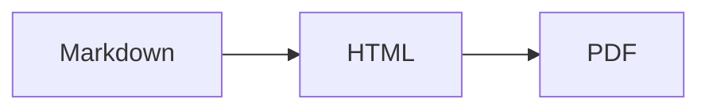

# Markdown to PDF converter

`generate_pdf.sh` converts a Markdown document into a styled A4 PDF. It supports
Mermaid diagrams and adds a centered page number to every page.

## Requirements

- Bash
- Python 3
- Node.js with `node`, `npm`, and `npx` available on `PATH`
- Internet access on the first run so npm can download `marked`, Puppeteer, and
  Mermaid CLI when needed

No global npm package installation is required.

## Usage

Run the script from any directory and provide an input Markdown file:

```bash
./scripts/generate_pdf.sh README_EN.md README_EN.pdf
```

The output argument is optional. When omitted, the PDF is created next to the
input file with the same base name:

```bash
./scripts/generate_pdf.sh README_EN.md
```

For example, this command creates `README_EN.pdf`.

You can also invoke the script by its absolute path:

```bash
~/paradigmas/paradigmas.github.io/scripts/generate_pdf.sh input.md output.pdf
```

Paths containing spaces must be quoted:

```bash
./scripts/generate_pdf.sh "docs/User guide.md" "build/User guide.pdf"
```

## Page numbers

Page numbers are enabled automatically. No Markdown directive or command-line
option is needed. `print_pdf.js` configures Puppeteer with
`displayHeaderFooter: true` and places Puppeteer's `pageNumber` value in the
center of the footer.

To include the total number of pages, edit the `footerTemplate` in
`print_pdf.js`:

```html
<span class="pageNumber"></span> / <span class="totalPages"></span>
```

To remove page numbers, edit `print_pdf.js` and set:

```js
displayHeaderFooter: false,
```

The bottom margin is currently `20mm`, which leaves room for the footer. If the
footer is clipped after customization, increase `margin.bottom` in
`print_pdf.js`.

## Mermaid diagrams

Use a fenced `mermaid` block in the Markdown document:

````markdown

````

The converter extracts each Mermaid block, renders it as an SVG with
`@mermaid-js/mermaid-cli`, and embeds the SVG in the generated PDF.

The opening and closing fences must be on separate lines. The opening fence
must be exactly ` ```mermaid ` in lowercase.

## PDF formatting

PDF settings are defined in `print_pdf.js`:

- Page size: A4
- Margins: `20mm` top and bottom, `15mm` left and right
- Background colors: enabled
- Page number: centered in the footer

Document styling is embedded in `generate_pdf.sh`. Edit its `<style>` block to
change fonts, colors, heading sizes, tables, code blocks, or page width.

## Execution flow

The script executes the conversion as follows:

1. **Validate the input:** It checks that the first argument identifies an
   existing Markdown file. If it does not, the script prints its usage and
   exits.
2. **Determine the output path:** It uses the second argument when provided.
   Otherwise, it replaces the input file's `.md` extension with `.pdf`.
3. **Create a temporary workspace:** It creates a directory for intermediate
   Markdown, HTML, Mermaid, and npm files. An exit trap schedules this directory
   for deletion whether the conversion succeeds or fails.
4. **Extract Mermaid blocks:** An embedded Python program finds fenced
   `mermaid` blocks, writes each diagram to a numbered `.mmd` file, and creates
   `rendered.md` with each block replaced by a reference to its future SVG.
5. **Render Mermaid diagrams:** If `.mmd` files were found, the script invokes
   `@mermaid-js/mermaid-cli` through `npx` for each one and writes the resulting
   SVG into the temporary Mermaid directory.
6. **Convert Markdown to HTML:** It runs `marked` through `npx`, converting
   `rendered.md` into an HTML fragment stored as `body.html`.
7. **Apply document styling:** A second embedded Python program wraps the HTML
   fragment in a complete HTML document and adds the GitHub-like CSS embedded
   in `generate_pdf.sh`. The result is written to `full.html`.
8. **Prepare the PDF renderer:** It installs Puppeteer under the temporary
   workspace with `npm install --no-save`, avoiding changes to the repository's
   dependencies.
9. **Render the PDF:** The script runs `print_pdf.js`, which opens `full.html`
   in headless Chrome and waits for network activity to finish. Puppeteer then
   prints it as an A4 PDF with backgrounds, margins, and page-number footers.
10. **Clean up:** After the command finishes, the exit trap removes the entire
    temporary workspace. Only the requested PDF remains.

## Limitations

- The script has no command-line switches for page size, margins, styles, or
  page numbering; change the source files to customize these settings.
- npm dependencies are downloaded during conversion rather than installed once
  and reused, so runs can be slow and require network access.
- Relative local image paths may not resolve because the intermediate Markdown
  and HTML files are generated in a temporary directory. Mermaid images are
  handled by the script.

## Troubleshooting

Check that the required commands are available:

```bash
node --version
npm --version
npx --version
python3 --version
```

If conversion fails while installing or running an npm package, verify network
and npm registry access. The temporary directory is deleted when the script
exits, including after most failures.

## Components and libraries

- **Bash**: Coordinates the conversion steps, validates arguments, and manages
  temporary files.
- **Python 3**: Extracts Mermaid blocks, replaces them with image references,
  and wraps the generated HTML with CSS.
- **Node.js**: Runs the JavaScript tools used for Markdown rendering and PDF
  generation.
- **npm and npx**: Download and execute the required Node.js packages without a
  global installation.
- **marked**: Converts the processed Markdown document into HTML.
- **Mermaid CLI (`@mermaid-js/mermaid-cli`)**: Converts Mermaid diagram blocks
  into SVG images.
- **Puppeteer**: Controls headless Chrome and prints the styled HTML as a PDF,
  including margins and page-number footers.
- **Headless Chrome**: Performs the final browser rendering so CSS, tables,
  code blocks, and SVG diagrams appear in the PDF.
